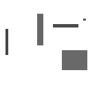
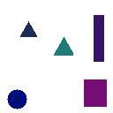
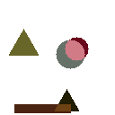

# :black_large_square: :red_circle: `generate-shapes`

A script to generate labeled toy datasets for object detection algorithms and
machine learning models (like [R-CNN](https://arxiv.org/abs/1506.01497)).

The script generates images containing circles, triangles or rectangles in color
or grayscale with configurable sizes and optional overlap. Additionally, it
emits a JSON file containing the name (class) and bounding box of each shape and
every image. Together, the images and labels file can be used to train or test
object detection and segmentation algorithms.

Some examples:

<p align="center">
  
  <br><br>
  <code>$ ./generate-shapes.py --number 1 --gray --shape rectangle --output-dir images</code>
  <br>
</p>

<p align="center">

<br><br>
<code>$ ./generate-shapes.py --number 1 --output-dir out</code>
<br>
</p>

<p align="center">
  
  <br><br>
  <code>$ ./generate-shapes.py --number 1 --allow-overlap --output-dir out</code>
  <br>
</p>

Example `labels.json`

```json
[
  {
    "boxes": [
      {
        "class": "circle",
        "x1": 78,
        "x2": 114,
        "y1": 24,
        "y2": 60
      }
    ]
  },
  {
    "boxes": [
      {
        "class": "triangle",
        "x1": 9,
        "x2": 68,
        "y1": 11,
        "y2": 63
      }
    ]
  }
]
```

## Options

```
usage: generate-shapes.py [-h] -n NUMBER [--width WIDTH] [--height HEIGHT]
              [--max-shapes MAX_SHAPES] [--min-shapes MIN_SHAPES]
              [--min-dimension MIN_DIMENSION] [--max-dimension MAX_DIMENSION]
              [--min-intensity MIN_INTENSITY] [--gray]
              [--shape {rectangle,circle,triangle}] [-o OUTPUT_DIR]
              [--allow-overlap]

Generate Toy Object Detection Dataset

optional arguments:
  -h, --help            show this help message and exit
  -n NUMBER, --number NUMBER
                        The number of images to generate
  --width WIDTH         The width of generated images (128)
  --height HEIGHT       The height of generated images (128)
  --max-shapes MAX_SHAPES
                        The maximum number of shapes per image (10)
  --min-shapes MIN_SHAPES
                        The maximum number of shapes per image (1)
  --min-dimension MIN_DIMENSION
                        The minimum dimension of a shape (10)
  --max-dimension MAX_DIMENSION
                        The maximum dimension of a shape (None)
  --min-intensity MIN_INTENSITY
                        The minimum intensity (0-255) for a pixel channel
                        (128)
  --gray                Make all shapes grayscale
  --shape {rectangle,circle,triangle}
                        Generate only this kind of shape
  -o OUTPUT_DIR, --output-dir OUTPUT_DIR
                        The output directory where to save images
  --allow-overlap       Allow shapes to overlap on images
```
